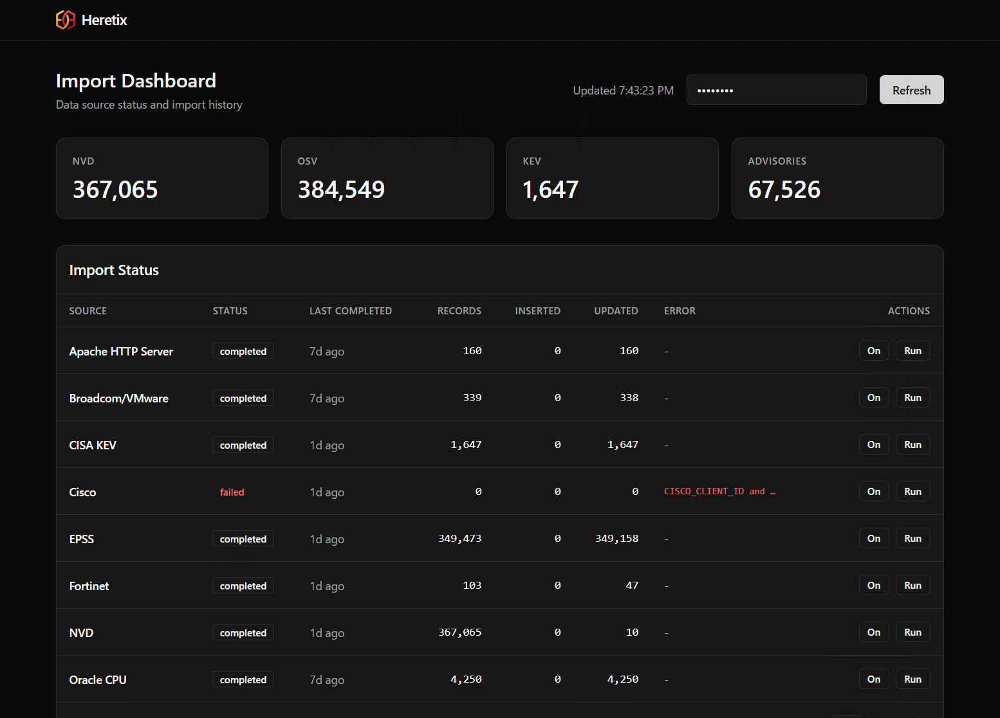

# Heretix API

heretix-api is the vulnerability database of **[heretix](https://titeee.github.io/heretix-web/)**, a self-hosted suite that tracks CVEs across servers, containers and network appliances (firewalls, VPNs) in one inventory (Apache-2.0).

[日本語版 README](README.ja.md)

## What it does

Ask it "is this software vulnerable?", by package name and version, and it answers from a local copy of public vulnerability data:

```
GET /api/v1/vulnerabilities/search?package=openssl&version=3.0.2-0ubuntu1.10&ecosystem=Ubuntu:22.04:LTS
→ 46 results, e.g.
  CVE-2024-6119  severity HIGH  distroPriority medium  fixedVersion 3.0.2-0ubuntu1.18  isKev false  epssScore 0.67
```

It works for language packages (npm, PyPI, Go, Maven, ...), Linux distribution packages (Debian, Ubuntu, Alpine, RHEL, ...) and network appliances and commercial products (FortiOS, PAN-OS, Cisco IOS XE, vCenter, ...). Each result says how severe the vulnerability is, whether it is being exploited, and how to fix it.

Where it sits in heretix:

```
 servers / containers / appliances
            │  inventory (package + version)
            ▼
 heretix-cli, heretix-management ── search ──► heretix-api ◄── scheduled imports ── OSV, NVD, KEV, EPSS,
            │                                  (PostgreSQL)                           CVE Records, vendor advisories
            ▼
 vulnerability reports
```

- **[heretix-cli](https://github.com/TITeee/heretix-cli)** scans a host or image and asks this API about each package.
- **[heretix-management](https://github.com/TITeee/heretix-management)** keeps the inventory and the findings.
- **heretix-api** (this repository) imports the public sources on a schedule into its own PostgreSQL database, so searches never call those sources directly.

It can also be used on its own, as a self-hosted vulnerability lookup API.

### How it works

1. **Import**: scheduled jobs download each source (OSV, NVD, CISA KEV, EPSS, CVE Records, and vendor advisories) into per-source tables.
2. **Merge**: records about the same CVE are linked to one master row, which also carries the exploitation signals (KEV, EPSS, CISA's SSVC assessment).
3. **Search**: a search compares the version you give against each source's affected ranges. It uses that ecosystem's own version rules (semver, dpkg, RPM, vendor-specific), and returns one result per vulnerability.

## Features

- **Vendor advisories**: Fortinet, Palo Alto Networks, Cisco, Sophos, SonicWall, Oracle CPU, Oracle Linux, Red Hat, Broadcom/VMware, Splunk, Apache HTTP Server, Apache Tomcat, nginx, Zabbix and Check Point
- **Distro-aware matching**: dpkg and RPM version comparison for Linux distributions, and each distro's own rating (`distroPriority`) and fix status (`fixStatus`, e.g. "will not fix") per result
- **Malware detection**: malicious packages from [ossf/malicious-packages](https://github.com/ossf/malicious-packages) (`MAL-*`), searchable like any vulnerability
- **Simple to run**: PostgreSQL only (no Redis), Docker Compose included, a built-in scheduler and an import dashboard

## Supported OS releases

OSV publishes data for distro releases going back to Debian 3.0, Alpine v3.2 and Ubuntu 14.04. Only the releases below are maintained, meaning they are covered by accuracy checks and fixes. The list is defined in [src/config/support-policy.ts](src/config/support-policy.ts) and was last reviewed on 2026-10-03.

| Distro | Maintained releases | Notes |
|---|---|---|
| Debian | 11, 12, 13, 14 | 11 is past regular EOL but still under Debian LTS |
| Ubuntu | 20.04, 22.04, 24.04, 26.04 LTS, including their Pro / FIPS / Realtime variants | 20.04 is kept for its ESM period. Interim releases (e.g. 25.10) are not maintained |
| Alpine | v3.21 – v3.24 | |
| AlmaLinux / Rocky Linux | 8, 9, 10 | |
| Red Hat Enterprise Linux | 8, 9, 10 | Imported from Red Hat, not OSV: OVAL plus VEX for 8/9, VEX only for 10 (Red Hat publishes no RHEL 10 OVAL) |

Data for other releases is **not deleted**. It stays searchable on a best-effort basis, without accuracy checks or fixes. Oracle Linux (imported from Oracle's OVAL feed) is also searchable on a best-effort basis. Language ecosystems (npm, PyPI, ...) are not affected by this policy.

## Requirements

Minimum sizing for a PoC deployment, from the [heretix requirements](https://titeee.github.io/heretix-web/docs/). The figures cover heretix-api and heretix-management together; heretix-api's PostgreSQL accounts for most of them.

| | Requirement |
|---|---|
| CPU | 2 vCPU minimum. The heretix-api container can burst to roughly 70% of one core during imports and searches, and PostgreSQL adds its own load during an import |
| RAM | 8 GB minimum, 16 GB recommended. heretix-api's PostgreSQL uses around 7.7 GB with a full NVD mirror and several OSV ecosystems loaded |
| Disk | 20 GB to start. heretix-api's database can reach around 11 GB after months of NVD and OSV data; budget more to import every OSV ecosystem |
| Software | Docker and Docker Compose v2, and git |
| Network | Outbound access to the public sources (nvd.nist.gov, osv.dev, GitHub, vendor sites) |

To run without Docker (Node.js 22, pnpm, PostgreSQL 15+), see [docs/operations.md](docs/operations.md#native).

## Quick start

### 1. Get the code and configure it

```bash
git clone https://github.com/TITeee/heretix-api.git
cd heretix-api
cp .env.example .env
```

Edit `.env` and set:
- `API_KEY`: any secret string. Every API request must send it as the `x-api-key` header.
- `POSTGRES_PASSWORD` (add the line): the password of the bundled database. Set your own: the default, `changeme`, is only for a local trial.
- `NVD_API_KEY` (optional, recommended): a [free NVD key](https://nvd.nist.gov/developers/request-an-api-key) makes the NVD import faster.

With Docker, `DATABASE_URL` in `.env` is ignored, because Compose connects the API to its own database.

### 2. Start it

```bash
docker compose up --build -d
docker compose ps                    # db and app are both up
curl http://localhost:5000/health    # → {"status":"ok",...}
```

On first start, the container creates the database schema and then starts the API on port 5000. Logs: `docker compose logs -f app`.

### 3. Load data

**The database starts empty**, and the scheduled NVD and OSV jobs only fetch *changes* since their last run. Run the initial import once before scanning anything:

```bash
# NVD: every CVE (~400k). Takes several hours, so run it in the background.
docker compose exec -d app pnpm import:nvd full

# OSV: only the ecosystems you actually scan
docker compose exec app pnpm import:osv ecosystem npm
docker compose exec app pnpm import:osv ecosystem PyPI
docker compose exec app pnpm import:osv ecosystem Go
docker compose exec app pnpm import:osv ecosystem "Ubuntu:22.04:LTS"
```

Then open the [dashboard](#dashboard) at `http://localhost:5000/dashboard` and enter your API key:
- The NVD row shows `running`, then `completed` when the import finishes.
- After NVD completes, press **Run** on CISA KEV and EPSS. They only annotate CVEs that are already in the database. Their daily runs keep them current after that.
- **Switch On the `osv-<ecosystem>` row of each OSV ecosystem you imported.** Without this, the ecosystem is never updated.
- For each other source you need, switch its job **On** and press **Run** once to load it: vendor advisories (Fortinet, Red Hat, ...), CVE Records (`cna`), malicious packages (`osv-mal`), and the Debian security tracker (`debian-tracker`).

Which sources to import: [docs/data-sources.md](docs/data-sources.md#choosing-what-to-import).

### 4. Search

```bash
export API_KEY=<your key>
curl -H "x-api-key: $API_KEY" \
  "http://localhost:5000/api/v1/vulnerabilities/search?package=lodash&version=4.17.20&ecosystem=npm"
```

Results appear as soon as the matching source has been imported.

### Stop and update

```bash
docker compose down             # stop; data is kept (add -v to delete it)
git pull && docker compose up --build -d   # update to the latest version
```

On start, the container applies any new database migrations and data backfills before the API answers. A backfill can take several minutes on a full database.

## Usage

Every endpoint except `/health` and the `/dashboard` page requires the `x-api-key` header.

```bash
# Distro package
curl -H "x-api-key: $API_KEY" \
  "http://localhost:5000/api/v1/vulnerabilities/search?package=bzip2-libs&version=1.0.8-8.el9&ecosystem=Red%20Hat:9"

# Network appliance (vendor advisory)
curl -H "x-api-key: $API_KEY" \
  "http://localhost:5000/api/v1/vulnerabilities/search?package=FortiOS&version=7.4.3"

# By ID
curl -H "x-api-key: $API_KEY" "http://localhost:5000/api/v1/vulnerabilities/CVE-2021-44228"
```

The `ecosystem` parameter changes which sources are queried and how versions are compared. Read [Search behavior by ecosystem](docs/api.md#search-behavior-by-ecosystem) before assuming a search returned everything.

| Endpoint | Purpose |
|---|---|
| `GET /api/v1/vulnerabilities/search` | Vulnerabilities affecting a package and version |
| `POST /api/v1/vulnerabilities/search/batch` | The same for up to 1,000 packages |
| `GET /api/v1/vulnerabilities/search/cpe` | Search by CPE 2.3 string (NVD) |
| `GET /api/v1/vulnerabilities/suggest` | Package name autocomplete |
| `GET /api/v1/vulnerabilities/:id` | Detail by CVE, OSV or vendor advisory ID |
| `GET /api/v1/vulnerabilities/stats` | Record counts |
| `POST /api/v1/jobs/:source/run`, `PATCH /api/v1/jobs/:source` | Run or enable/disable an import job |

Full reference, including every response field: [docs/api.md](docs/api.md).

## Dashboard

`http://localhost:5000/dashboard` shows each source's import status and record count. From the dashboard you can switch scheduled jobs on and off and run them on demand. To see the data, enter your API key in the top-right field.



## Data collection

Only NVD, KEV and EPSS run by default; switch on the others you need.

| Source | What it provides | Schedule (UTC) |
|---|---|---|
| NVD | Every CVE, CPE ranges, CVSS | Every 2 hours |
| CISA KEV | Known-exploited flag | Daily 09:00 |
| EPSS | Exploitation probability | Daily 10:00 |
| OSV | Language ecosystems, Linux distributions, malware | Daily 08:00, one job per ecosystem |
| CVE Records (CNA) | CNA-declared affected products, CISA SSVC | Daily 15:30 |
| Red Hat | OVAL (RHEL 8/9) and CSAF VEX (unfixed CVEs; all of RHEL 10) | Daily 13:15 – 15:00 |
| Debian security tracker | Fix status (`no-dsa`, `ignored`, ...) | Daily 07:15 |
| Vendor advisories | Fortinet, PAN, Cisco, Oracle, Broadcom, ... | Daily 11:00 – 16:00 |

Per-source details, import commands and limitations: [docs/data-sources.md](docs/data-sources.md).

## Documentation

| Document | Contents |
|---|---|
| [docs/api.md](docs/api.md) | API reference and search behavior |
| [docs/data-sources.md](docs/data-sources.md) | Each data source: how it is imported, commands, caveats |
| [docs/operations.md](docs/operations.md) | Setup, environment variables, scheduler, backfills, troubleshooting |
| [docs/architecture.md](docs/architecture.md) | Data model, deduplication, version matching |
| [docs/known-issues.md](docs/known-issues.md) | Current limitations |
| [ACCURACY.md](ACCURACY.md) | Precision / recall measurements against official advisories |
| [CONTRIBUTING.md](CONTRIBUTING.md) | Development, tests, adding a vendor |

## License

Apache License 2.0. See [LICENSE](LICENSE) for details.
