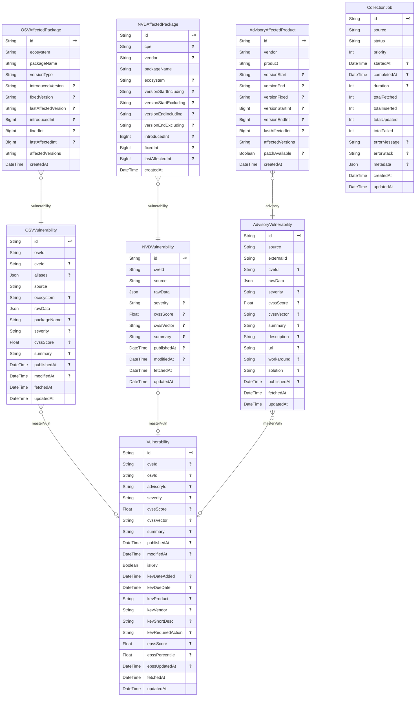

```mermaid
erDiagram

  "Vulnerability" {
    String id "🗝️"
    String cveId "❓"
    String osvId "❓"
    String advisoryId "❓"
    String severity "❓"
    Float cvssScore "❓"
    String cvssVector "❓"
    String summary "❓"
    DateTime publishedAt "❓"
    DateTime modifiedAt "❓"
    Boolean isKev 
    DateTime kevDateAdded "❓"
    DateTime kevDueDate "❓"
    String kevProduct "❓"
    String kevVendor "❓"
    String kevShortDesc "❓"
    String kevRequiredAction "❓"
    Float epssScore "❓"
    Float epssPercentile "❓"
    DateTime epssUpdatedAt "❓"
    DateTime fetchedAt 
    DateTime updatedAt 
    }
  

  "OSVVulnerability" {
    String id "🗝️"
    String osvId 
    String cveId "❓"
    Json aliases "❓"
    String source 
    String ecosystem "❓"
    Json rawData 
    String packageName "❓"
    String severity "❓"
    Float cvssScore "❓"
    String summary "❓"
    DateTime publishedAt "❓"
    DateTime modifiedAt "❓"
    DateTime fetchedAt 
    DateTime updatedAt 
    }
  

  "OSVAffectedPackage" {
    String id "🗝️"
    String ecosystem 
    String packageName 
    String versionType 
    String introducedVersion "❓"
    String fixedVersion "❓"
    String lastAffectedVersion "❓"
    BigInt introducedInt "❓"
    BigInt fixedInt "❓"
    BigInt lastAffectedInt "❓"
    String affectedVersions 
    DateTime createdAt 
    }
  

  "NVDVulnerability" {
    String id "🗝️"
    String cveId 
    String source 
    Json rawData 
    String severity "❓"
    Float cvssScore "❓"
    String cvssVector "❓"
    String summary "❓"
    DateTime publishedAt "❓"
    DateTime modifiedAt "❓"
    DateTime fetchedAt 
    DateTime updatedAt 
    }
  

  "NVDAffectedPackage" {
    String id "🗝️"
    String cpe "❓"
    String vendor "❓"
    String packageName 
    String ecosystem "❓"
    String versionStartIncluding "❓"
    String versionStartExcluding "❓"
    String versionEndIncluding "❓"
    String versionEndExcluding "❓"
    BigInt introducedInt "❓"
    BigInt fixedInt "❓"
    BigInt lastAffectedInt "❓"
    DateTime createdAt 
    }
  

  "AdvisoryVulnerability" {
    String id "🗝️"
    String source 
    String externalId 
    String cveId "❓"
    Json rawData 
    String severity "❓"
    Float cvssScore "❓"
    String cvssVector "❓"
    String summary "❓"
    String description "❓"
    String url "❓"
    String workaround "❓"
    String solution "❓"
    DateTime publishedAt "❓"
    DateTime fetchedAt 
    DateTime updatedAt 
    }
  

  "AdvisoryAffectedProduct" {
    String id "🗝️"
    String vendor 
    String product 
    String versionStart "❓"
    String versionEnd "❓"
    String versionFixed "❓"
    BigInt versionStartInt "❓"
    BigInt versionEndInt "❓"
    BigInt lastAffectedInt "❓"
    String affectedVersions 
    Boolean patchAvailable "❓"
    DateTime createdAt 
    }
  

  "CollectionJob" {
    String id "🗝️"
    String source 
    String status 
    Int priority 
    DateTime startedAt "❓"
    DateTime completedAt "❓"
    Int duration "❓"
    Int totalFetched 
    Int totalInserted 
    Int totalUpdated 
    Int totalFailed 
    String errorMessage "❓"
    String errorStack "❓"
    Json metadata "❓"
    DateTime createdAt 
    DateTime updatedAt 
    }
  
    "OSVVulnerability" }o--|o "Vulnerability" : "masterVuln"
    "OSVAffectedPackage" }o--|| "OSVVulnerability" : "vulnerability"
    "NVDVulnerability" |o--|o "Vulnerability" : "masterVuln"
    "NVDAffectedPackage" }o--|| "NVDVulnerability" : "vulnerability"
    "AdvisoryVulnerability" }o--|o "Vulnerability" : "masterVuln"
    "AdvisoryAffectedProduct" }o--|| "AdvisoryVulnerability" : "advisory"
```
